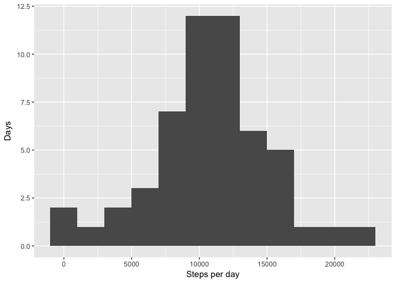
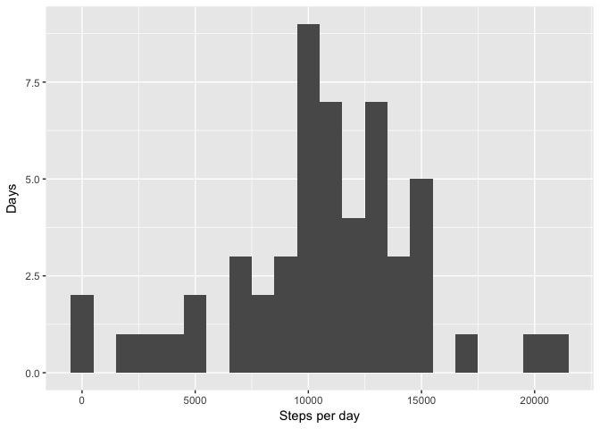
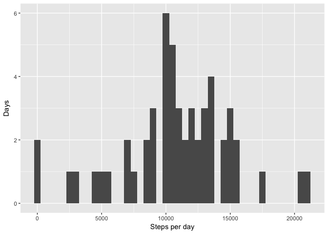
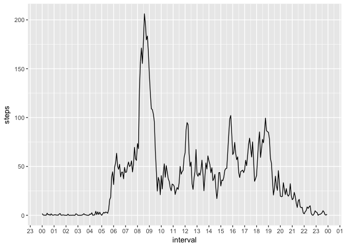
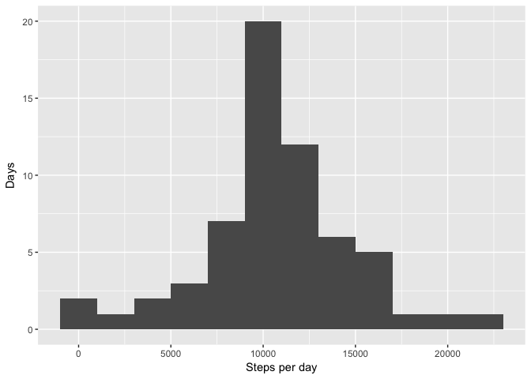
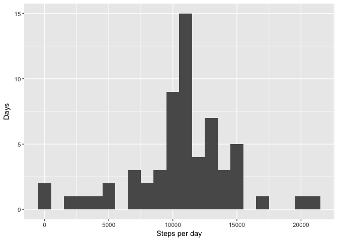
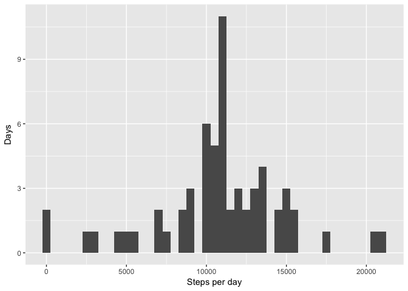
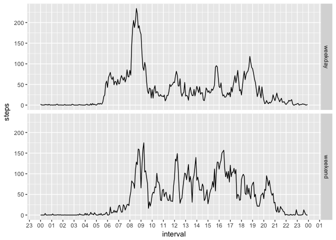

# Reproducible Research: Peer Assessment 1


## Loading and preprocessing the data

```r
dataset <- read.csv("activity.csv")
str(dataset)
```

```
## 'data.frame':	17568 obs. of  3 variables:
##  $ steps   : int  NA NA NA NA NA NA NA NA NA NA ...
##  $ date    : Factor w/ 61 levels "2012-10-01","2012-10-02",..: 1 1 1 1 1 1 1 1 1 1 ...
##  $ interval: int  0 5 10 15 20 25 30 35 40 45 ...
```

```r
#Add datetime as typed interval
dataset$datetime <- strptime(
        paste(dataset$date, sprintf("%04d", dataset$interval)), 
        format = "%Y-%m-%d %H%M")

#Format interval
dataset$interval <- strftime(dataset$datetime, "%H:%M")
```

## What is mean total number of steps taken per day?

```r
totals <- aggregate(dataset$steps, by = list(dataset$date), FUN = sum)
names(totals) <- c("date", "total.number.of.steps")

# Drop all NA values in number of steps variable
completeTotals <- totals[!is.na(totals$total.number.of.steps), ]
```

### Explore number of steps per day variable
Let's plot total number of steps per day as histogram starting at 2000 steps per bin:

```r
qplot(completeTotals$total.number.of.steps, geom = "histogram", 
      binwidth = 2000, xlab = "Steps per day", ylab = "Days")
```

<!-- -->

Looks like values between 8000 and 16000 are most common. Let's look at 1000 steps per bin:

```r
qplot(completeTotals$total.number.of.steps, geom = "histogram", 
      binwidth = 1000, xlab = "Steps per day", ylab = "Days")
```

<!-- -->

values between 10000 and 15000 seem to stand out. Now at 500 steps per bin:

```r
qplot(completeTotals$total.number.of.steps, geom = "histogram", 
      binwidth = 500, xlab = "Steps per day", ylab = "Days")
```

<!-- -->

From all the plots above values from 10000 to 15000 steps a day seem to be most 
frequent. Mean and median number of steps per day (ignoring missing values):


```r
meanSteps = mean(totals$total.number.of.steps, na.rm = TRUE)
medianSteps = median(totals$total.number.of.steps, na.rm = TRUE)
kable(data.frame("Mean" = meanSteps, "Median" = medianSteps), 
      digits = 2, align = 'l', caption = "Steps per day")
```


Table: Steps per day

Mean       Median 
---------  -------
10766.19   10765  

## What is the average daily activity pattern?

Let's take a look at daily activity and see if we can spot any patterns:

```r
stepsByInterval <- aggregate(steps ~ interval, dataset, FUN = mean, na.rm = TRUE)
ggplot(stepsByInterval, aes(strptime(interval, format = "%H:%M"), steps, group = 1)) + 
        geom_line() + 
        scale_x_datetime(name = "interval", date_labels = "%H", date_breaks = "1 hour")
```

<!-- -->

Looks like the most of the steps are done between 8:00 and 9:30. Maximum average number
of steps fall into this interval:


```r
kable(stepsByInterval[stepsByInterval$steps == max(stepsByInterval$steps), ], 
      digits = 2, align = 'l', caption = "Interval with maximun average number of steps",
      row.names = FALSE)
```


Table: Interval with maximun average number of steps

interval   steps  
---------  -------
08:35      206.17 

## Imputing missing values
Dataset has missing data for some intervals:

```r
missing <- sum(is.na(dataset$steps))
kable(data.frame("total" = missing, "percent" = round(missing * 100 / nrow(dataset), 1)), 
      digits = 2, align = 'l', caption = "Missing observations",
      row.names = FALSE, col.names = c("count", "%"))
```


Table: Missing observations

count   %    
------  -----
2304    13.1 

We will replace missing observations with average for that specific 5 minute 
interval across all the days.


```r
filledDs <- dataset
filledDs$steps[is.na(filledDs$steps)] <- 
        with(filledDs, ave(steps, interval, 
                           FUN = function(x) mean(x, na.rm = TRUE)))[is.na(filledDs$steps)]
```

First ten observations before filling in the averages:

```r
kable(head(dataset, 10))
```


 steps  date         interval   datetime            
------  -----------  ---------  --------------------
    NA  2012-10-01   00:00      2012-10-01 00:00:00 
    NA  2012-10-01   00:05      2012-10-01 00:05:00 
    NA  2012-10-01   00:10      2012-10-01 00:10:00 
    NA  2012-10-01   00:15      2012-10-01 00:15:00 
    NA  2012-10-01   00:20      2012-10-01 00:20:00 
    NA  2012-10-01   00:25      2012-10-01 00:25:00 
    NA  2012-10-01   00:30      2012-10-01 00:30:00 
    NA  2012-10-01   00:35      2012-10-01 00:35:00 
    NA  2012-10-01   00:40      2012-10-01 00:40:00 
    NA  2012-10-01   00:45      2012-10-01 00:45:00 

First ten observations after filling in the averages:

```r
kable(head(filledDs, 10))
```

     steps  date         interval   datetime            
----------  -----------  ---------  --------------------
 1.7169811  2012-10-01   00:00      2012-10-01 00:00:00 
 0.3396226  2012-10-01   00:05      2012-10-01 00:05:00 
 0.1320755  2012-10-01   00:10      2012-10-01 00:10:00 
 0.1509434  2012-10-01   00:15      2012-10-01 00:15:00 
 0.0754717  2012-10-01   00:20      2012-10-01 00:20:00 
 2.0943396  2012-10-01   00:25      2012-10-01 00:25:00 
 0.5283019  2012-10-01   00:30      2012-10-01 00:30:00 
 0.8679245  2012-10-01   00:35      2012-10-01 00:35:00 
 0.0000000  2012-10-01   00:40      2012-10-01 00:40:00 
 1.4716981  2012-10-01   00:45      2012-10-01 00:45:00 

## Overview (after filling it the averages)

### Explore number of steps per day variable

```r
filledTotals <- aggregate(filledDs$steps, by = list(filledDs$date), FUN = sum)
names(filledTotals) <- c("date", "total.number.of.steps")
```

Number of steps per day as histogram at 2000 steps per bin:

```r
qplot(filledTotals$total.number.of.steps, geom = "histogram", 
      binwidth = 2000, xlab = "Steps per day", ylab = "Days")
```

<!-- -->

Number of steps per day as histogram at 1000 steps per bin:

```r
qplot(filledTotals$total.number.of.steps, geom = "histogram", 
      binwidth = 1000, xlab = "Steps per day", ylab = "Days")
```

<!-- -->

Number of steps per day as histogram at 500 steps per bin:

```r
qplot(filledTotals$total.number.of.steps, geom = "histogram", 
      binwidth = 500, xlab = "Steps per day", ylab = "Days")
```

<!-- -->

Mean and median number of steps per day (ignoring missing values):


```r
filledMeanSteps = mean(filledTotals$total.number.of.steps, na.rm = TRUE)
filledMedianSteps = median(filledTotals$total.number.of.steps, na.rm = TRUE)
kable(data.frame("Mean" = filledMeanSteps, "Median" = filledMedianSteps), 
      digits = 2, align = 'l', caption = "Steps per day")
```


Table: Steps per day

Mean       Median   
---------  ---------
10766.19   10766.19 

Looks like filling it averages for 5 minute intervals instead of NA did not 
change the average number of steps per day, but moved median value.

## Are there differences in activity patterns between weekdays and weekends?

Let's categorize the dates by weekend and weekdays and compare daily activity:

```r
dataset$day <- weekdays(dataset$datetime)
dataset$day[dataset$day %in% c("Saturday", "Sunday")] <- "weekend"
dataset$day[dataset$day != "weekend" ] <- "weekday"
dataset$day <- factor(dataset$day)

stepsByIntervalAndDay <- aggregate(steps ~ interval + day, dataset, FUN = mean, na.rm = TRUE)

ggplot(stepsByIntervalAndDay) + 
        geom_line(aes(strptime(interval, format = "%H:%M"), steps, group = 1)) + 
        scale_x_datetime(name = "interval", date_labels = "%H", date_breaks = "1 hour") + facet_grid(day ~ .)
```

<!-- -->

Looks like on weekdays the activity starts two hours or so earlier than on weekends.
Shocking! :)
